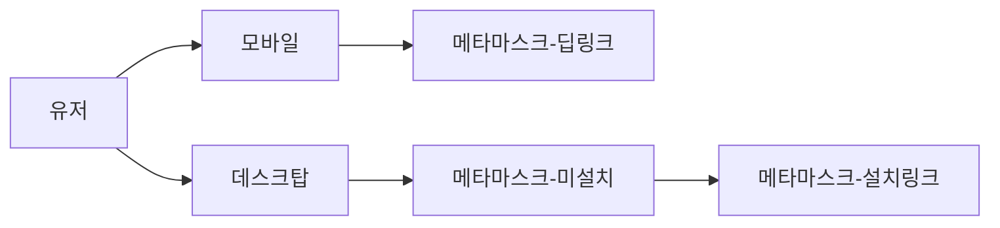
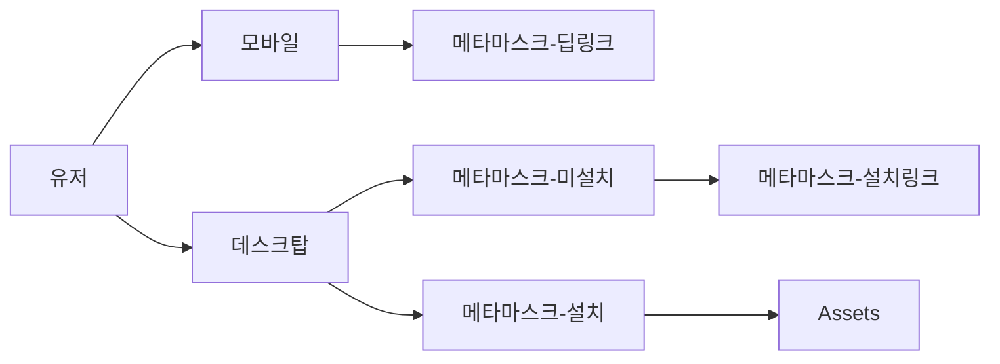
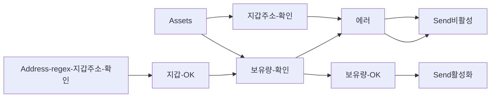
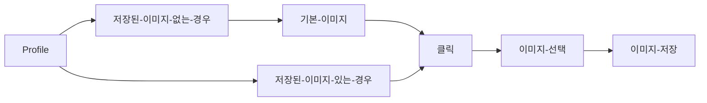

# Trala lab

## How to run
```
yarn start
```

## How to test 
```
yarn test
```

테스트 파일은 App.spec.tsx, Assets.spec.tsx 두 가지가 있습니다

## App.spec.tsx
메타 마스크로 설치에 따라 뷰가 제대로 나오는지 확인합니다.

## Assets.spec.tsx
보낼 Balance의 input에 자연수 혹은 소숫점이 들어가는지 확인합니다.


## Web-flow
1. Assets 

2. Send

3. Profile

